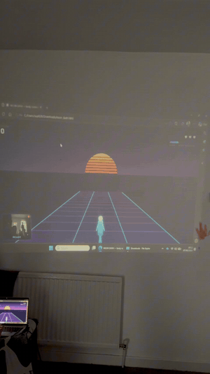

# Neon Dash

A body-controlled endless runner you play with a webcam. No controller, no keyboard. You run, jump, squat and lean in front of your laptop, and your real movements drive the character. It runs entirely in the browser as a single HTML file.

I built it because I had gained some weight and lost interest in the gym, and I wanted a reason to move that felt like play instead of a chore. The idea was simple: turn a short burst of exercise into a game I would actually want to repeat.

## Demo

*The game projected on a wall and played live with a laptop webcam.*

## What it does

The webcam reads your body pose in real time and maps it to game controls:

| Your movement | In the game |
| --- | --- |
| Run in place | Build pace and move faster |
| Jump | Clear the low neon bars |
| Squat | Duck under the high bars |
| Jump or lean left / right | Switch lane |

You get three lives, a forgiving hit window, and a score that rewards you for keeping your pace up, so the longer you keep moving, the better you do.

## Why it is interesting

- It is a fitness loop disguised as a game. To score well you have to keep running in place, with jumps and squats mixed in.
- It runs fully in the browser. The pose detection happens on your machine, so the camera feed never leaves your computer and nothing is uploaded.
- No install and no hardware beyond a laptop with a webcam. Open one HTML file in a Chromium browser and play.

## How it works

The project has two parts in a single file.

**1. Calibration.** Before playing, you calibrate once. The app guides you through eight short poses (stand, jump, squat, lean left, lean right, jump left, jump right, run in place) using voice prompts and a countdown. From those samples it learns thresholds that are specific to your body and your camera position, for example how high your jump rises relative to your torso, your knee angle in a squat, your tilt in a lean, and the direction your sideways jumps travel. The result is saved as a small JSON profile in browser storage, so you only calibrate once per setup.

**2. Live detection and game.** Each frame, the camera image is passed to a pose model that returns body landmarks. A small feature layer turns those landmarks into camera-independent signals (a jump becomes an upward spike relative to your standing height, a squat becomes a true 3D knee angle, a lean becomes shoulder-over-hip tilt, running becomes an alternating knee-lift oscillation). A detector compares those signals against your calibrated thresholds and emits clean events and held states, which the game reads as controls.

A few design choices that mattered:

- Thresholds are personal, learned at calibration, instead of fixed magic numbers, because every body and camera angle is different.
- Detection uses ratios (rise over torso height, tilt in shoulder widths, 3D joint angles) so it works the same whether you stand close or far, and whether the camera looks slightly up or down.
- The game is built to be forgiving. Obstacles are telegraphed seconds ahead and a single misread frame never ends a run, because real time pose detection has occasional glitches and the game should not punish them.

## Tech stack

- Pose detection: MediaPipe Tasks Vision (PoseLandmarker, lite model)
- Rendering: HTML5 Canvas, plain JavaScript, no framework
- Voice prompts: Web Speech API
- Storage: browser localStorage for calibration profiles
- One self-contained `.html` file, no build step

## Run it

1. Download `neon_dash.html`.
2. Open it in a Chromium based browser (Microsoft Edge or Chrome).
3. Allow camera access when asked.
4. Add a profile, calibrate once, then play.

Tips for good tracking: stand far enough back that your whole body is in frame with a little space above your head and below your feet, and play in reasonable lighting.

## Profiles and your data

Calibration profiles are stored in the browser under keys named `poseUser_<name>`. The data stays on your machine and is never sent anywhere. Clearing the browser site data removes saved profiles.

## Limitations and honest notes

- This is a personal prototype, not a polished product.
- Walk versus run separation on a single 2D webcam is hard, so the game uses one running state rather than trying to tell a walk from a jog.
- Pose detection can misread at the moment one action transitions into another. The game is designed to tolerate this rather than eliminate it.
- It is built for a desktop or laptop webcam in a Chromium browser. It is not tuned for phones.

## Roadmap

- Export and import buttons so a profile can be saved to a file and moved between machines
- Difficulty modes and a longer obstacle vocabulary
- A short on screen tutorial run
- Optional rhythm or workout modes that reuse the same body controls

## Acknowledgements

Built with Google MediaPipe for pose landmark detection.
